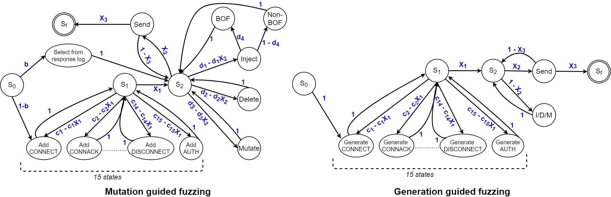

# FUME-Fuzzing-MQTT-Brokers

A successor to [MosquittoByte](https://github.com/PBearson/MosquittoByte).

A demo of FUME can be viewed [on Youtube](https://www.youtube.com/watch?v=99gAayiIcEo).

## Get Started

## Configuring your Fuzzing Session

## Crash Triage

## Bugs Discovered with FUME

If you want to test FUME yourself on the same brokers we did, please refer to [this repository](https://github.com/PBearson/FUME_Targets).

* [CVE-2021-28166](https://nvd.nist.gov/vuln/detail/CVE-2021-28166): In Mosquitto v2.0.0 - 2.0.9, a null pointer dereference occurs when a client sends MQTT v5 CONNACK packet.
* [CVE-2021-34432](https://nvd.nist.gov/vuln/detail/CVE-2021-34432): In Mosquitto v2.0.7 and earlier, the server crashes if the client sends a PUBLISH packet with topic length = 0.
* [KMQTT broken pipe error](https://github.com/davidepianca98/KMQTT/commit/7a4e31567c1a850e86bdc0660e243e7e6e9a33cf): In KMQTT version 0.2.7 and earlier, the server may crash if it tries on send a packet (e.g., SUBACK) to a closed TCP connection.
* [aedes malformed DISCONNECT](https://github.com/mqttjs/mqtt-packet/pull/107): In aedes 0.45.0, the server may crash if a client tries to send a malformed DISCONNECT packet.
  * This is actually due to a bug in mqtt-tools 6.9.0, a node package which aedes depends on.
